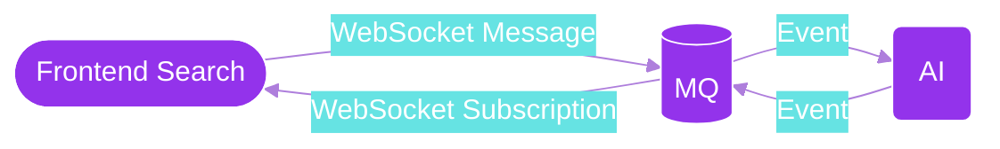

# Roadmap

**_So many possible changes!_**

In addition to normal product enhancements, there's a rapidly changing AI ecosystem. Newer larger faster language models are being created with improved ways of interacting with them.

Some of the highlights on the roadmap include:

- [ ] [Vector Embedding / LLM](#vector-embedding--llm)
- [ ] [Recommendation System](#recommendation-system)
- [ ] [Additional Media Sources](#additional-media-sources)
- [ ] [Event-Driven Architecture](#event-driven-architecture)
- [ ] [Transcriptions](#transcriptions)
- [ ] [Documentation](#documentation)

Additional changes:

- [ ] [Ongoing Refactoring](#ongoing-refactoring)
- [ ] [Frontend Structure](#frontend-structure)

---

## Highlights

### Vector Embedding / LLM

The platform uses a transformer _retriever_/_reader_ pipeline.

Currently a sparse _retriever_ is used with [BM25](https://www.elastic.co/blog/practical-bm25-part-2-the-bm25-algorithm-and-its-variables) to narrow down results. This is however a large bottleneck in increasing result quality. Without embedded context lots of valuable results are left behind.

A dense [dual-encoder framework](https://arxiv.org/abs/2004.04906) _retriever_ would be much better. By using a vector database, the retriever could use context to calculate relevance between the question and transcriptions before the _reader_ stage.

An LLM (Large Language Model) would be used to generate dense representations for both the question and transcriptions. These representations would be embedded and queried with a vector database (some options include [Elasticsearch](https://www.elastic.co/guide/en/elasticsearch/reference/current/dense-vector.html), [Milvus](https://milvus.io/), [Faiss](https://faiss.ai/), and [Weaviate](https://weaviate.io/)).

### Recommendation System

Recommendations between segments, episodes, series, and topics related to content the user is interested in would be great. This could be accomplished using vector embedding.

### Additional Media Sources

Currently the only the Lex Fridman podcast from YouTube is being processed. It would be great to expand this to additional podcast series and maybe other source types.

As far as UX, the video format seems to be working quite well. Switching to another media type such as audio might bring new UX challenges. While audio is great for passive listening and for live discussions, in our situation it might prove to be a difficult media type to keep users engaged. Perhaps audio snippets could be more to-the-point, answering questions directly with less context. The UI could have karaoke-style transcriptions.

Know thought-provoking podcast series? Feel free to open a GitHub issue mentioning these podcasts.

### Event-Driven Architecture

#### Backend Data Flow

For this early proof-of-concept podcast episodes were manually seeded with a couple scripts. In order to scale to multiple podcast series, media sources and stay up to date with the latest episodes an event-driven architecture would be beneficial. The data could flow as shown above.

#### Frontend Data Flow

For searching/querying the AI from the frontend it would be beneficial to implement WebSockets/SSE. For longer running queries, such as when the AI is processing the question, this would allow a message to be sent once the query is completed.

Additionally the backend search could work using events. Each new search query would be queued. The AI would consume these queued events and publish a new event upon completion.

### Transcriptions

The transcription quality used for training, and timing of each individual word could be improved. An option could be [Whisper](https://github.com/openai/whisper) by OpenAI.

### Documentation

Additional documentation about the architecture, roadmap, development, installation, management and deployment is required.

## Secondary

### Ongoing Refactoring

Teation is in early development. It was created in a couple days by [Patrick Nomad](https://twitter.com/nomad_patrick) as a hobby project. Some of its parts were quickly hacked together for the initial proof of concept.

There's a time and place for everything. Sometimes it's better to get something off the ground quickly. Sometimes it's better to follow proper principles.

As this remains a hobby project, its parts will slowly be refactored while implementing new features.

Feel free to suggest changes by creating a new issue on GitHub. Feel like contributing? Check out the [contribution notes](./development.md#contributions).

### Frontend Structure

Apart from the frontend changes spawned from the features mentioned above, some other changed includes:

- [ ] Add a sitemap and/or a "Top Questions" page. This would allow for search engines to find and index the top question pages.
- [ ] Add discovery though topics. Topics could be generated using an LLM based on the available segments.
- [ ] Add prerendering for SEO if cache exists for a given question/query.